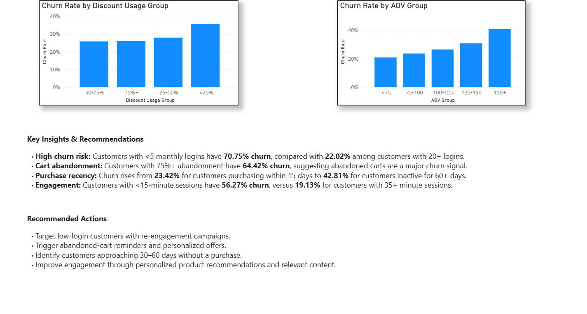

# E-Commerce Customer Churn Analysis

## About the Project

I worked on this project to understand why customers are churning from an e-commerce platform and to identify the customer behaviors that are most closely associated with churn.

The dataset contains **50,000 customer records** with information about customer activity, purchases, engagement, discounts, cart abandonment, and other behavioral attributes.

I used **PostgreSQL for the analysis** and **Power BI to build an interactive dashboard** that makes the results easier to explore.

## Tools Used

* PostgreSQL / SQL
* Power BI
* DAX
* Excel (for initial data exploration)

## What I Worked On

I started by exploring the dataset and checking the data for issues such as missing values and unusual values.

From there, I looked at overall churn and then broke customers into different groups to see how churn varied across different behaviors.

Some of the areas I analyzed were:

* Purchase recency
* Login frequency
* Session duration
* Cart abandonment
* Discount usage
* Average order value
* Membership tenure
* Country
* Signup quarter

I then created an interactive Power BI dashboard where the results can be filtered by **country and gender**.

## Key Findings

The overall churn rate in the dataset is **28.90%**.

Some of the more interesting patterns I found were:

* Customers with **fewer than 5 logins per month** had a churn rate of **70.75%**.
* Customers with **75%+ cart abandonment** had a churn rate of **64.42%**.
* Customers with **sessions under 15 minutes** had a churn rate of **56.27%**.
* Customers who had not purchased for **60+ days** had a churn rate of **42.81%**.
* Customers with **35+ minute sessions** had a much lower churn rate of **19.13%**.
* Customers with **20+ monthly logins** had a churn rate of **22.02%**.

One thing I found particularly interesting was that **higher average order value did not necessarily mean lower churn**. Customers with an AOV of 150+ had a churn rate of **40.87%**, which would be worth investigating further.

These findings show a strong relationship between customer engagement and churn, although the analysis does not by itself prove that these behaviors cause churn.

## Dashboard

### Overview

The first dashboard page focuses on the overall customer base and the main churn drivers.


### Customer Segmentation

The second page looks at churn across different customer segments.



## Recommendations

Based on the patterns found in the analysis, some possible areas for further action would be:

* Identify customers with very low login frequency and target them with re-engagement campaigns.
* Follow up with customers who frequently abandon their carts.
* Monitor customers approaching longer periods without a purchase.
* Look for ways to increase product engagement and session activity.
* Investigate why some high-value customers have relatively high churn.

## Project Structure

```text
ecommerce-customer-churn-analysis/
│
├── data/
│   └── ecommerce_customer_churn.csv
│
├── sql/
│   ├── 01_data_quality.sql
│   ├── 02_churn_analysis.sql
│   └── 03_customer_segmentation.sql
│
├── powerbi/
│   └── ecommerce_customer_churn.pbix
│
├── screenshots/
│   ├── dashboard_overview.png
│   └── customer_segmentation.png
│
└── README.md
```

## What I Learned

This project helped me get more comfortable working through an analysis from start to finish — starting with raw customer data, exploring it using SQL, creating calculated measures in Power BI, and finally presenting the findings through an interactive dashboard.

It also helped me understand that the goal of an analytics project isn't just to find numbers, but to turn those numbers into **business questions, insights, and potential actions**.
